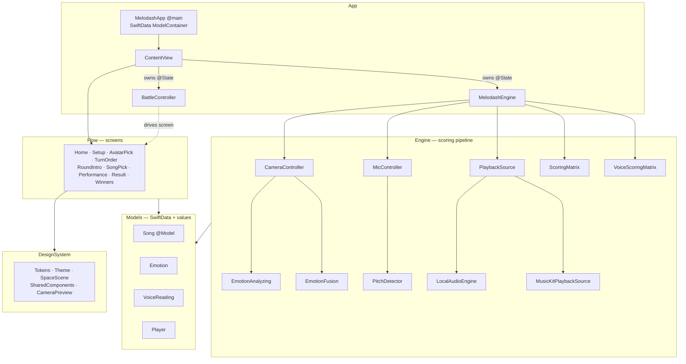
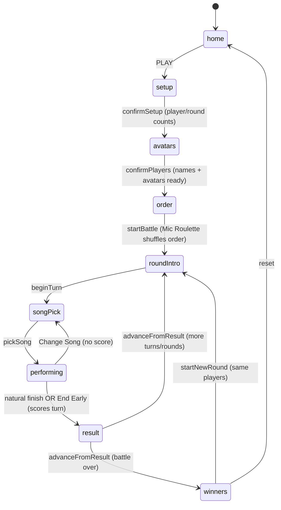
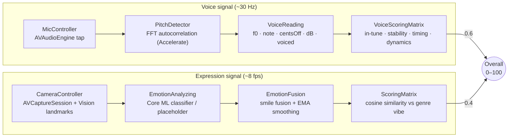
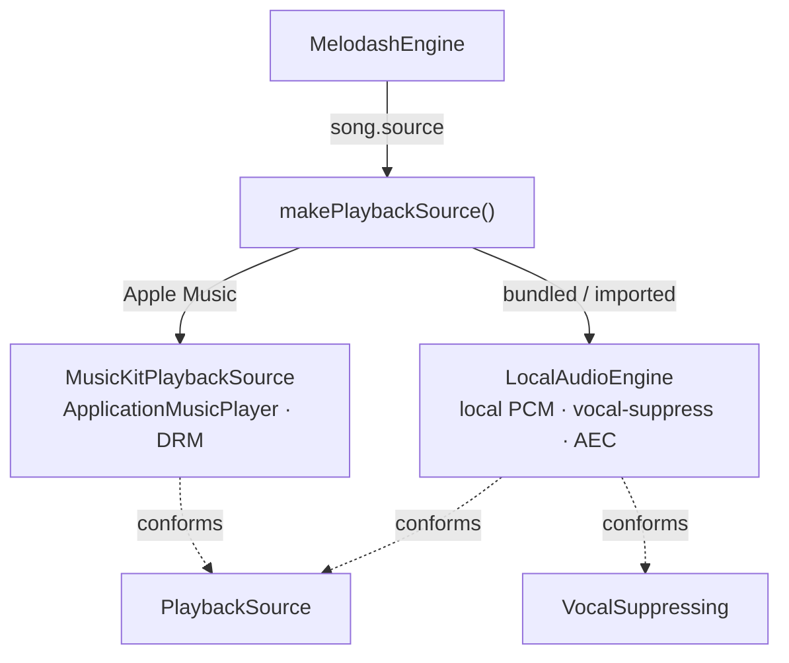
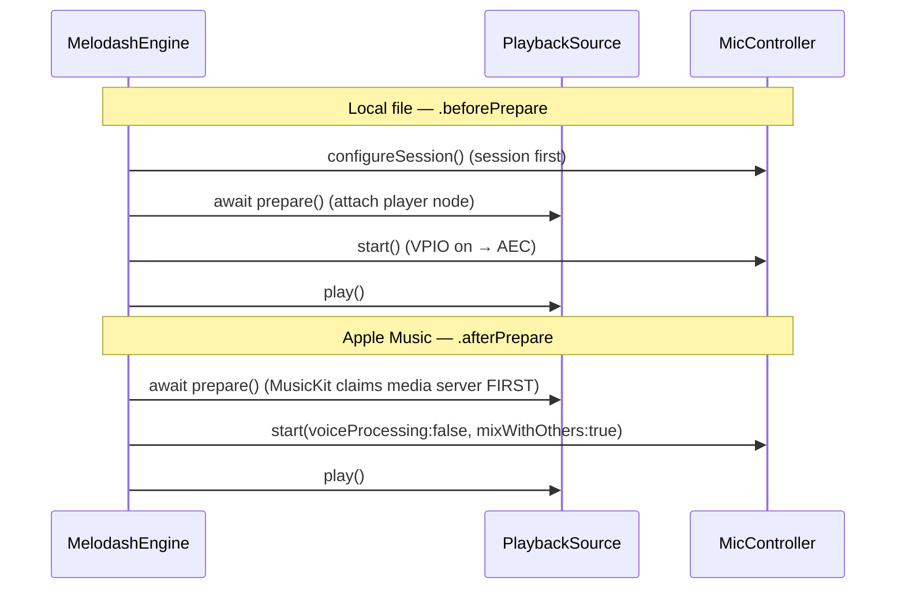
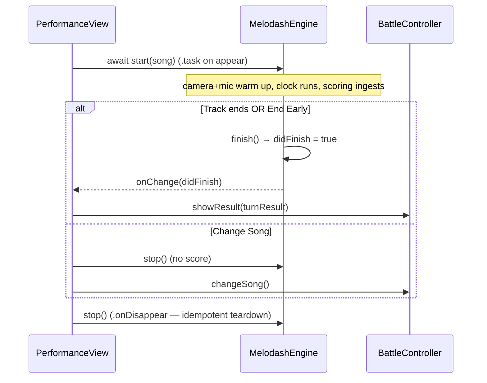
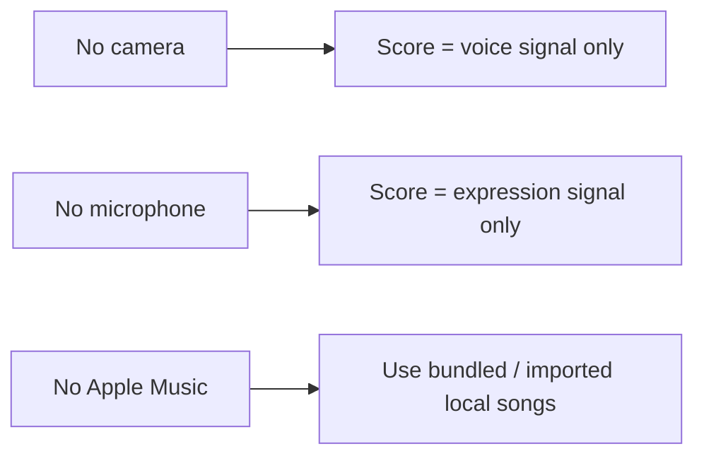

# Melodash — Technical Report

> **Melodash** is a local, couch-multiplayer **singing battle**. 2–5 players take turns
> singing; each performance is scored **entirely on-device** on two independent signals —
> **how you sound** (pitch, stability, timing, dynamics) and **how you look** (facial
> expression vs. the song's emotional "vibe"). A space-themed, single-window wizard runs the
> whole battle: setup → avatars → turn order → per-turn performance & results → final podium.
>
> Built with **SwiftUI + SwiftData**, Apple frameworks only (Vision, Core ML, AVFoundation,
> Accelerate, MusicKit). Runs on **macOS and iOS** from one codebase.

---

## Table of contents

1. [System architecture](#1-system-architecture)
2. [The battle flow (state machine)](#2-the-battle-flow-state-machine)
3. [The scoring engine — the heart of the app](#3-the-scoring-engine--the-heart-of-the-app)
4. [The audio engine & session choreography](#4-the-audio-engine--session-choreography)
5. [The performance lifecycle & the single clock](#5-the-performance-lifecycle--the-single-clock)
6. [Key design decisions & the alternatives we rejected](#6-key-design-decisions--the-alternatives-we-rejected)
7. [Challenges we hit and how we solved them](#7-challenges-we-hit-and-how-we-solved-them)
8. [Concurrency model](#8-concurrency-model)
9. [Data & persistence](#9-data--persistence)
10. [Privacy, permissions & graceful degradation](#10-privacy-permissions--graceful-degradation)
11. [Accessibility & localization](#11-accessibility--localization)
12. [Known limitations & future work](#12-known-limitations--future-work)
13. [Appendix — module map](#13-appendix--module-map)

---

## 1. System architecture

Melodash is layered so that the **game flow**, the **scoring/audio engine**, and the
**design system** are independent and testable. The two roots of the app are a
`BattleController` (the game state machine) and a `MelodashEngine` (the per-turn scoring
coordinator); everything else hangs off protocol seams.



**Design principles that shaped the structure**

- **Protocol seams at every hardware/ML boundary.** `PlaybackSource`, `EmotionAnalyzing`,
  and `VocalSuppressing` decouple the engine from concrete implementations, so the same
  `MelodashEngine` drives a local file, an Apple Music stream, a real Core ML model, or a
  geometry placeholder without knowing which.
- **One coordinator per concern.** `BattleController` owns *who plays and in what order*;
  `MelodashEngine` owns *how one turn is captured and scored*. They meet only at the
  `TurnResult` handoff.
- **A design system, not scattered styling.** Colours, radii, strokes, and the space-scene
  visuals are centralized in `DesignSystem/Tokens.swift` + `Theme.swift`, so screens compose
  tokens and shared components rather than re-deriving magic numbers.

---

## 2. The battle flow (state machine)

`BattleController` is a small, cohesive `@Observable` state machine. The root view switches on
`battle.screen`; every screen mutates state through the controller's narrow API. There is no
`NavigationStack` — this is a **kiosk-style single-window wizard** by design (it plays on a
shared TV/laptop, not a phone with a nav bar).



Two derived views the controller exposes power the UI without duplicating state:
`turnOrder` (each singer tagged done/singing/upcoming, for the in-game Lobby) and
`leaderboard` (players sorted by average score, for the podium). Because both read straight off
`order` and `players`, they can never drift from what actually plays.

> **Why one controller and not several?** We deliberately **kept `BattleController` whole**.
> It is ~210 lines with clear sections (state → derived → navigation → lobby). Splitting it
> into "state machine / scoring / presentation" objects would force every screen to reference
> multiple objects for negligible benefit — added indirection, not clarity. Cohesion here is a
> feature.

---

## 3. The scoring engine — the heart of the app

This is the most important, least obvious part of Melodash. **A performance is scored on two
signals that run simultaneously**, then blended. Drop either and it's just a pitch game or just
a face game — the mechanic *is* the combination.



### 3.1 The voice sub-scores

`VoiceScoringMatrix` ingests only **voiced** frames (a silence/breath/low-confidence gate) and
produces four *relative, self-referential* sub-scores — **no reference melody is needed**:

| Sub-score | Weight | How it's computed |
|---|---:|---|
| **In-tune-ness** | 0.40 | Mean of `max(0, 1 − |cents| / 50)` per voiced frame. 0¢ off = 1.0, ≥50¢ off = 0. |
| **Stability** | 0.25 | Within each run on the same note (≥3 frames), `exp(−σ/30)` on the cents spread, length-weighted. Steady note ⇒ ~1.0; 30¢ wobble ⇒ ~0.37. |
| **Timing** | 0.20 | For each lyric-line start, the nearest detected vocal **onset** (unvoiced→voiced transition), scored `max(0, 1 − |Δt| / 0.6s)`. |
| **Dynamics** | 0.15 | The p90−p10 loudness spread (dBFS) over the whole take, normalized 3 dB → 0, 18 dB → 100. Rewards expressive dynamics, not shouting. |

The weighted blend runs **only over the sub-scores that were measurable** — if timing has no
lyrics to compare against, its weight simply drops out. `nil` (never voiced ⇒ mic off) is a
first-class signal, not a zero.

**Pitch detection** (`PitchDetector`) is a realtime-safe FFT autocorrelation over a preallocated
**2048-sample window (~46 ms @ 44.1 kHz), hop 1024** (~50% overlap), all via Accelerate/vDSP.
A **5-sample median filter** kills single-frame octave jumps; gates at ~−45 dBFS RMS and 0.7
confidence reject unvoiced frames.

### 3.2 The expression sub-score

The expression path answers *"does this face match the song's mood?"* — not raw emotion
recognition.

1. **`CameraController`** runs `VNDetectFaceLandmarksRequest` on the front camera at ~8 fps on a
   background queue, and hands the cropped face to an `EmotionAnalyzing`.
2. **`EmotionAnalyzing`** is the seam: `CoreMLEmotionAnalyzer` (a Create ML image classifier,
   `MelodashEmotionClassifier.mlmodelc`, cropped to the face by Vision) when the model is
   bundled, else `PlaceholderEmotionAnalyzer` (a geometry heuristic so the whole pipeline is
   demoable with no model).
3. **`EmotionFusion`** fuses two sources into a smoothed probability vector: it sensitivity-scales
   the classifier, then folds a **Vision-landmark smile score** into the `happy` channel
   (`0.4·model + 0.6·gated-smile`, smiles below 0.35 ignored) — because a *static* image
   classifier reads a mid-song mouth weakly. An **exponential moving average (α = 0.45)** stops
   the live badge flickering frame to frame.
4. **`ScoringMatrix`** takes the **cosine similarity** of that emotion vector against the song
   genre's **target profile**, averaged over frames where a face was present:

| `SongGenre` | Target emotion profile |
|---|---|
| Energetic Pop | energetic 1.0 · happy 0.6 |
| Sad Ballad | sad 1.0 |
| Uplifting | happy 1.0 · energetic 0.4 |
| Chill | neutral 1.0 · happy 0.3 |

Weights need not sum to 1 — cosine similarity normalizes, so only the *shape* of the vibe
matters. The genre is classified from free-form Apple Music / file genre tags via a keyword
matcher.

### 3.3 The blend, and graceful degradation

```
overall = round(0.4 · expressionScore + 0.6 · voiceScore)
```

Voice is weighted higher (you are, after all, *singing*), but the blend **degrades to whichever
signal exists**: no camera ⇒ voice alone; no mic ⇒ expression alone. Expression is a *blended
signal, never a gate*, so a player who can't or won't face the camera still gets a fair score.

> **Non-obvious decision — relative scoring, no reference track.** We score singing on
> *internal* qualities (in-tune-ness to the nearest note, self-consistency, dynamics) rather
> than aligning to a ground-truth melody. Reference alignment (DTW against a MIDI/stem) would be
> "more correct" but needs per-song reference data we don't have for arbitrary Apple Music
> tracks — and for a party game, *fair and fun* beat *musicologically exact*. The seams are in
> place to add reference alignment later without touching the UI.

---

## 4. The audio engine & session choreography

The trickiest engineering in the app is not the DSP — it's making the **microphone, the backing
track, and (sometimes) Apple Music** coexist on one device without the audio server dropping the
route.

### 4.1 One shared engine, for echo cancellation

`MicController` owns **the** `AVAudioEngine`, and `LocalAudioEngine` attaches its backing-track
player node to that *same* engine. Why: the input node's **voice-processing I/O unit (VPIO)**
does hardware **echo cancellation** using the engine's own output as the reference — so the mic
hears *you*, not the song leaking from the speaker. That only works if both live on one graph.

### 4.2 Two playback backends behind one seam



`PlaybackSource` abstracts *the master clock, prepare/play/seek, and finish detection* so the
rest of the app is identical for both. **`VocalSuppressing` is split out separately** (Interface
Segregation): only local PCM can dim the lead vocal (a 0.5·(L−R) center-channel suppressor), so
Apple Music simply doesn't conform, and the toggle is offered only when `playback is
VocalSuppressing`.

### 4.3 The "ping did not pong" problem

Apple Music (`ApplicationMusicPlayer`) renders *outside* our `AVAudioEngine`, through the media
server. Bringing up a `.playAndRecord` session with the VPIO unit **before** MusicKit has claimed
the route starves it — `prepareToPlay()` times out with a `mediaserverd` "ping did not pong" and
you get silence. Local files have the opposite constraint: the session must be configured *before*
the player node attaches, or you crash on "player started when in a disconnected state."

The ordering is subtle and **source-specific**, so each source *declares its own strategy*
(`SessionActivation`) and the engine sequences it — **without a `song.source` switch** (DIP):



For Apple Music the mic runs **without VPIO** and **with `.mixWithOthers`** — AEC is useless on
DRM audio anyway (no reference signal), and mixing keeps MusicKit's route alive. We recommend
**headphones** for Apple Music songs so the mic hears only the singer.

---

## 5. The performance lifecycle & the single clock

### 5.1 One audio clock drives everything

The single most valuable architectural decision: **lyric highlighting, scoring windows, and the
progress bar all read the same clock** — `playback.currentTime`, sampled by a 20 Hz timer. There
is no independent "UI time" to drift out of sync with the audio. Seeks update the clock
optimistically (jump the UI to the requested position immediately; the next tick reconciles to
the true position) because MusicKit doesn't report a new `playbackTime` instantly.

### 5.2 Turn lifecycle — start, finish, and *not* scoring

`MelodashEngine` is owned once by the root and **reused across turns**; the performing screen
drives it via `.task` (start on appear) and `.onDisappear` (stop). A precise distinction prevents
the classic double-fire bug:

- **`finish()`** — the natural end (track completes) *or* **End Early**. Finalizes the sub-scores
  and flags `didFinish`, which hands off to the results screen and records the score.
- **`stop()`** — external teardown (leaving the screen, **Change Song**). Tears down the audio
  graph but **deliberately does not flag `didFinish`**, so an abandoned turn is never scored.



---

## 6. Key design decisions & the alternatives we rejected

| Decision | We chose | Alternative considered | Why we rejected it |
|---|---|---|---|
| **Expression input** | Vision landmarks + a Core ML classifier | **ARKit blendshapes** (our first instinct) | ARKit is **iOS + TrueDepth only** and doesn't exist on macOS. The moment the product became a shared-screen laptop game, ARKit couldn't come along. Vision + Core ML reads a plain camera frame on *both* platforms. |
| **Platform** | macOS-first, multiplatform | iOS-only phone app | It's more fun as a **pass-the-mic battle on a big screen** than solo phone karaoke. That reframed the whole product into a turn-based battle with a podium. |
| **Song playback** | Two backends behind `PlaybackSource` | One unified player | Apple Music is DRM (no samples); local files we own. A single abstraction would either lose local DSP or pretend suppression works on DRM. Two implementations, one seam. |
| **Vocal suppression** | Center-channel `0.5·(L−R)`, local only | An on-device **Demucs**-style ML stem separator | Overkill for a jam; center-channel removal is instant and realtime-safe. `VocalSuppressing` is a seam so an ML separator can drop in later. |
| **Scoring model** | Relative, self-referential (no reference track) | **DTW alignment** to a ground-truth melody/stem | We can't get reference stems for arbitrary Apple Music tracks, and *fair & fun* beat *exact* for a party game. |
| **Mic → UI delivery** | One ordered `AsyncStream` consumer | A `Task { @MainActor }` per frame | Per-frame tasks (~30/s) are unordered and allocate each time. One long-lived consumer is ordered and cheap. |
| **Engine ownership** | One engine, coordinator-owned, reused | A fresh engine per turn forced by SwiftUI `.id()` | The `.id()` remount hack was "load-bearing and fragile." Explicit `start`/`stop` lifecycle removes the per-turn teardown-rebuild race. |
| **Game state** | One cohesive `BattleController` | Decomposed into multiple objects | The controller is small and cohesive; splitting adds indirection every screen would pay for. We kept it whole on purpose. |
| **`Song` storage** | Flat SwiftData columns + computed enums | Normalized per-source sub-models | Flat storage with raw-string-backed enums keeps schema changes to **automatic lightweight migrations**; normalization risked migration failures for no runtime gain. |

---

## 7. Challenges we hit and how we solved them

**ARKit → the macOS wall.** When we moved to a multiplatform target, every `import ARKit` failed
to compile — the framework isn't on macOS. *Solution:* removed ARKit entirely, made Vision +
Core ML the single expression path behind `EmotionAnalyzing`.

**`AVAudioSession` is iOS-only.** Session configuration compiles on iOS but is absent on macOS.
*Solution:* all `AVAudioSession` usage is `#if os(iOS)`-guarded; the macOS build configures the
`AVAudioEngine` directly.

**DRM on Apple Music.** No sample access ⇒ no vocal dimming and no offline analysis of catalog
audio — a platform boundary, not a bug. *Solution:* two-tier playback (full DSP for local,
plain playback for Apple Music) and a headphones nudge.

**The media-server race.** See [§4.3](#43-the-ping-did-not-pong-problem) — the "ping did not
pong" ordering. *Solution:* each source declares a `SessionActivation` strategy; the engine
sequences session setup off that, VPIO off + `.mixWithOthers` for Apple Music.

**Realtime audio thread × Swift concurrency.** The mic tap runs on a realtime thread, but the app
builds with **default main-actor isolation**, and readings must reach the main actor without data
races or per-frame allocations. *Solution:* the tap-thread buffer state stays tap-confined (a
reasoned `@unchecked Sendable`); readings flow through an `AsyncStream` to one ordered main-actor
consumer; `VoiceReading` is a `nonisolated` `Sendable` value type so it can cross threads.

**Seek felt "frozen."** After scrubbing, lyrics/progress sat at the old spot for a beat because
we read `playback.currentTime` straight back and MusicKit hadn't updated it yet. *Solution:*
optimistic UI — jump to the requested target immediately, reconcile on the next tick.

**Lyrics for Apple Music.** MusicKit exposes no lyrics API. *Solution:* fetch synced `.lrc` at
runtime (LRCLIB, with a fallback aggregator), disambiguated by track **duration** so multi-match
songs pick the right-length lyrics; bundled songs use their own `.lrc`.

---

## 8. Concurrency model

- **`MelodashEngine`, `BattleController`, controllers** are `@MainActor` / `@Observable`; SwiftUI
  observes them directly.
- **Capture runs off the main actor:** the camera on a background queue (~8 fps), the mic tap on
  a realtime audio thread (~30 Hz post-throttle). Both hand results back to the main actor —
  camera via a callback, mic via an ordered `AsyncStream`.
- **Value types cross actor boundaries:** `EmotionReading` and `VoiceReading` are `Sendable`
  structs, so a reading produced off-main is safe to read on-main.
- **The project uses default main-actor isolation**, which makes the `nonisolated` annotations on
  the realtime types load-bearing (without them, `VoiceReading.empty` would be main-actor-isolated
  and unusable from the tap).
- **Lifecycle tokens are cleaned up:** the audio-session interruption observer is removed on
  `deinit`; the clock timer is invalidated on every stop/pause/finish.

---

## 9. Data & persistence

`Song` is the only persisted model (SwiftData `@Model`), seeded once from a small bundled catalog
(`SampleData.seedIfNeeded`). Everything about a battle — `Player`, `Avatar`, `TurnResult`,
turn order, scores — is **ephemeral** value state on `BattleController` (a battle is one sitting).

`Song` stores its enums (`genre`, `source`, `displayGenre`) as **raw strings with computed
accessors**, and gives new fields nil/default values. This is deliberate: it keeps every schema
change an **automatic lightweight migration** (existing rows get the default) rather than a
store-open failure. Per-source fields (bundled filename, imported security-scoped bookmark,
Apple Music id + artwork URL) live flat on the model and are read by `source`.

---

## 10. Privacy, permissions & graceful degradation

Everything runs **on-device**. Camera frames and audio are analyzed live and **never uploaded or
persisted**. The app runs in the **App Sandbox** with exactly three capabilities — camera,
microphone, and outbound network — and the network is used **only** for Apple Music (MusicKit)
and public lyric lookup (a song's title/artist/duration). Usage-description strings say plainly
what each is for.

When a permission is denied, the app **degrades — it never blocks or crashes**:



The subscription state is checked up front for Apple Music songs, and a missing/inactive
subscription surfaces a **dismissible warning** rather than silent failure.

---

## 11. Accessibility & localization

- **Multi-modal by construction.** Because scoring blends voice *and* expression (neither is a
  gate), players can lean on whichever modality suits them.
- **Dynamic-Type-friendly** system controls where the custom display fonts aren't essential.
- **Not localized** (English only) — a deliberate jam-scope call; on-screen text is minimal and
  playful, and the strings are plain SwiftUI `Text`, so localization is a mechanical add later.
- **Known gap:** expression scoring assumes a visible face. We treat it as a *blended* signal so
  a camera-averse player still scores on voice, but in a real release we'd make this explicit and
  configurable.

---

## 12. Known limitations & future work

- **Emotion-classifier quality** is bounded by the training faces; the placeholder fallback keeps
  the app running when the model is absent, but it isn't real recognition.
- **No reference-melody scoring** yet (see [§3.3](#33-the-blend-and-graceful-degradation)) — the
  `PlaybackSource` / scoring seams are ready for DTW alignment when reference data exists.
- **Apple Music audio seek latency** is a MusicKit/DRM limitation; only the UI is made snappy.
- **Bundle identifier** remains `me.babonoo.kemon` (the MusicKit-registered App ID) even though
  the app is branded Melodash — flipping it needs a new registered App ID with MusicKit enabled.
- **No automated test target** yet; the pure scoring types (`ScoringMatrix`,
  `VoiceScoringMatrix`, genre classification) are the obvious first unit tests.

---

## 13. Appendix — module map

```
Melodash/
├─ App/            MelodashApp (@main, ModelContainer), ContentView (screen router)
├─ Models/         Song (+ genres/enums), Emotion, VoiceReading, Player/Avatar, BattleTurn, SampleData, SongImporter
├─ Engine/         MelodashEngine (coordinator + clock)
│                  PlaybackSource + LocalAudioEngine + MusicKitPlaybackSource + VoiceSuppressor
│                  MicController + PitchDetector · CameraController + EmotionAnalyzing + EmotionFusion + FaceGeometry
│                  ScoringMatrix · VoiceScoringMatrix · LyricsLoader + LyricsService
├─ Flow/           BattleController + the battle screens (Home, Setup, AvatarPick, TurnOrder,
│                  RoundIntro, SongPick, Performance, Result, Winners, Lobby) + AppleMusicSearcher
├─ DesignSystem/   Tokens · Theme · SpaceScene · SharedComponents · CameraPreview
└─ Resources/      Info.plist, fonts (Orbitron, Poppins); Assets and the optional
                   MelodashEmotionClassifier.mlmodel live alongside
```

**Framework roles at a glance:** SwiftUI (all UI) · SwiftData (Song catalog) · Vision + Core ML
(expression) · AVFoundation/AVAudioEngine + Accelerate (voice) · MusicKit (Apple Music, optional).
The mechanic requires the camera **and** audio pipelines running at once; MusicKit is the one
piece that's cleanly optional (the app is fully playable on local files).
